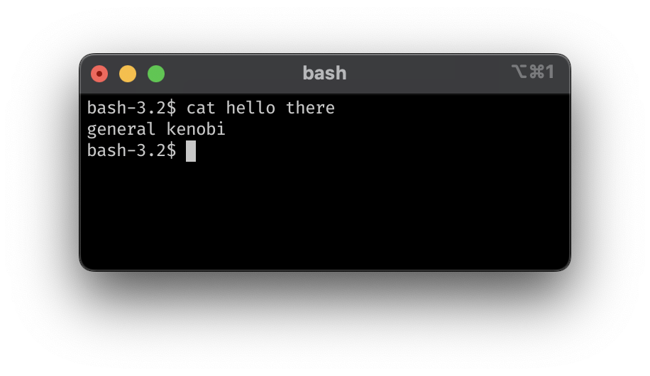

# Iniciamos 16:10

Registra tu asistencia en [tecodi.ng/taller245](https://tecodi.ng/taller245)


# `bash`

Taller de **bash scripting** nivel intermedio


## Han Rodríguez

**VP TECoding**
8º ITC

- AI Research @ Tec
- 2x Fellow @ MLH
- SWE Intern @ Intel
- SWE Intern @ MSFT


## Requisitos

Presentaciones:
[tecodi.ng/bash101](https://tecodi.ng/bash101) - [tecodi.ng/bash102](https://tecodi.ng/bash102)

Recursos:
- Tener instalado WSL (Windows solamente) (pág. 5)
- Conocimientos básicos de programación
- Conocimientos de comandos básicos de bash (pág. 7)

## Interfaz de línea de comandos



## Repaso de comandos

```bash
pwd     # parent working dir.   - dirección de carpeta actual
ls      # list                  - archivos en carpeta
cd      # change directory      - cambiar de carpeta
mkdir   # make directory        - crear carpeta
rmdir   # remove directory      - borrar carpeta vacía
touch   # create                - crear archivo vacío
rm      # remove                - borrar archivo o carpeta (-r)
cp      # copy                  - copiar archivo o carpeta (-r)
mv      # move                  - mover archivo o carpeta (-r)

echo    # print                 - imprimir en pantalla
chmod   # change mode           - cambiar permisos de archivo/script
cat     # concatenate           - mostrar contenido de archivo
grep    # global regex print    - buscar patrón de texto
>       # output redirection    - pasar salida de comando a archivo
|       # pipe                  - pasar salida de comando a otro comando

man [cmd]   # q: salir
[cmd] -h    [cmd] --help
```

## Repaso de sintaxis

- Declarar y asignar una variable
```bash
una_var=99
mi_var1=abc
var_123="abc"
```

- Acceder a una variable
```bash
${una_var}
$mi_var1 # no recomendado
```

## Editores de texto

#### `nano`
- Salir: `Ctrl + X`

#### `vim`
- Entrar al modo edición: `i`
- Salir del modo edición: `Esc`
- Guardar y salir: `:x`

## Estructuras de control

### Condicionales

```bash
if [[ `condicion` ]] then
     echo "hello"
elif [[ `condicion` ]] then
     echo "world"
else
     echo "error"
fi
```

---

- Comparación:
     - `-eq` igual
     - `-ne` no igual
     - `-gt, -lt` mayor que, menor que
     - `-ge, -le` mayor o igual, menor o igual

- Archivos:
     - `-e` existe
     - `-f` es archivo
     - `-d` es directorio
     - `-r, -w, -x` permite de leer, escribir, ejecutar.

### Ciclos

```bash
for var in a b c d e
do
     echo ${var}
done

for var in "a b c d e"
do
     echo ${var}
done
```

## Comandos avanzados

### Redireccionamiento de salida

```bash
echo "hola" > "archivo.txt"
echo "mundo" >> "archivo.txt"
cat "archivo.txt" | grep "la"
```

### Sustitución de comandos
```bash
for line in $(cat "archivo.txt")
do
     echo "linea: ${line}"
done

                                                  #
```

### Sustitución de comandos
```bash
for line in $(cat "archivo.txt")
do
     echo "linea: ${line}"
done

cat "archivo.txt" | xargs -I{} echo "linea: {}"   #
```

### Comandos compuestos
```bash
cat "archivo.txt" && echo "fin del documento" || echo "archivo inexistente"
```