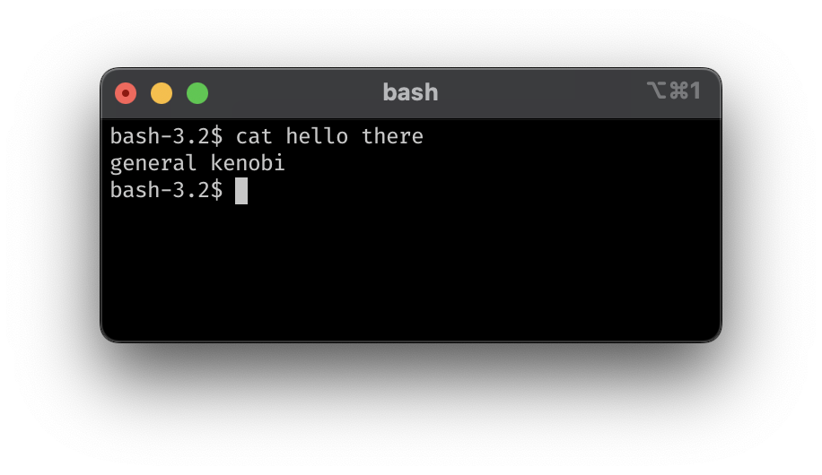
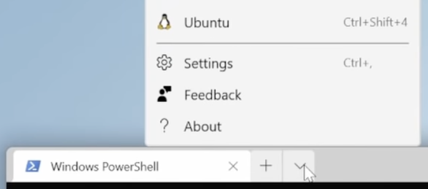

# Iniciamos 13:10

Registra tu asistencia en [bit.ly/tecodingabril2024](https://bit.ly/tecodingabril2024)


# `bash`

Taller de **bash scripting**


## Han Rodríguez

**VP TECoding**
8º ITC

- AI Research @ Tec
- 2x Fellow @ MLH
- SWE Intern @ Intel
- SWE Intern @ MSFT


## Interfaz de línea de comandos



---

1. Instalar Windows Terminal de la Tienda Microsoft
2. Abrir la terminal como administrador (clic derecho)
3. `wsl.exe --install` **(es necesario reiniciar)**
4. Introducir nombre de usuario y contraseña nuevos
5. Abrir la terminal y crear una pestaña de Ubuntu



---

Verificar que estemos en el directorio de nuestra cuenta
/Users/username/
/mnt/c/Users/username/

## Comandos

```bash
pwd     # parent working dir.   - dirección de carpeta actual
ls      # list                  - archivos en carpeta
cd      # change directory      - cambiar de carpeta
mkdir   # make directory        - crear carpeta
rmdir   # remove directory      - borrar carpeta vacía
touch   # create                - crear archivo vacío
rm      # remove                - borrar archivo o carpeta (-r)
cp      # copy                  - copiar archivo o carpeta (-r)
mv      # move                  - mover archivo o carpeta (-r)

echo    # print                 - imprimir en pantalla
chmod   # change mode           - cambiar permisos de archivo/script
cat     # concatenate           - mostrar contenido de archivo
grep    # global regex print    - buscar patrón de texto
>       # output redirection    - pasar salida de comando a archivo
|       # pipe                  - pasar salida de comando a otro comando

man [cmd]   # q: salir
[cmd] -h    [cmd] --help
```

## Creemos nuestro primer script

holahola.sh
```bash
#!/usr/bin/env bash

echo "Hola, mundo!"
```

Habilitar ejecución y probar
```bash
[gonzalpi@macos ~]$ chmod u+x holahola.sh
[gonzalpi@macos ~]$ ./holahola.sh
# Hola, mundo!
```

## Habilitar globalmente

```bash
cd                      # regresar a directorio raíz de bash
mkdir custom_scripts
nano .bashrc            # .zshrc para macOS, agregar sig. línea al final:
                        # export PATH="$HOME/custom_scripts:$PATH"
mv holahola.sh custom_scripts/holahola  # mover script a carpeta
exit
```
```bash
holahola      # script puede correr desde cualquier directorio 
```

## Script con argumentos

El script recibe argumento para nombrar archivo

```bash
#!/usr/bin/env bash
if [[ -n "${1}" ]]
then nuevo_archivo="${1}.md"
else nuevo_archivo="nuevas_notas.md"
fi
if [[ -f "${nuevo_archivo}" ]]
then echo "El archivo ${nuevo_archivo} ya existe"
     exit 1
fi
echo "# Notas: ${nuevo_archivo}" > ${nuevo_archivo}
echo "El archivo ${nuevo_archivo} ha sido creado"
```

## Ejercicio

El script recibe un segundo argumento y lo pone de título

```bash
#!/usr/bin/env bash
if [[ -n "${1}" ]]
then nuevo_archivo="${1}.md"
else nuevo_archivo="nuevas_notas.md"
fi
if [[ -f "${nuevo_archivo}" ]]
then echo "El archivo ${nuevo_archivo} ya existe"
     exit 1
fi
echo "# Notas: ${titulo}" > ${nuevo_archivo}
echo "El archivo ${nuevo_archivo} ha sido creado"
```

## Solución

```bash
#!/usr/bin/env bash
if [[ -n "${1}" ]]
then nuevo_archivo="${1}.md"
else nuevo_archivo="nuevas_notas.md"
fi
if [[ -f "${nuevo_archivo}" ]]
then echo "El archivo ${nuevo_archivo} ya existe"
     exit 1
fi
if [[ -n "${2}" ]]
then titulo="${2}"
else titulo="${nuevo_archivo}"
fi
echo "# Notas: ${titulo}" > ${nuevo_archivo}
echo "El archivo ${nuevo_archivo} ha sido creado"
```