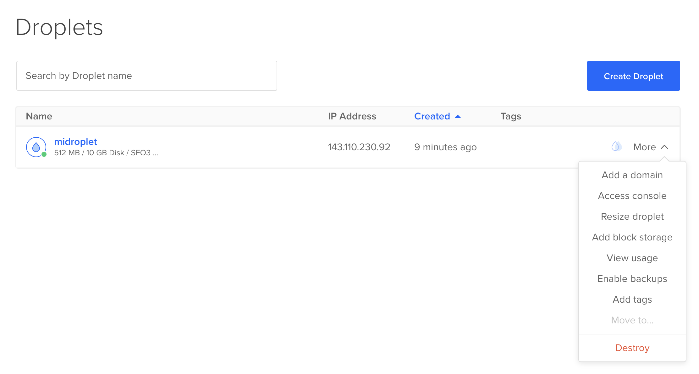

# Iniciamos 13:40

Registra tu asistencia en [tecodi.ng/taller240](https://tecodi.ng/taller240)


# Despliegue de apps en la nube


## Han Rodríguez

**VP TECoding**
8º ITC

- AI Research @ Tec
- 2x Fellow @ MLH
- SWE Intern @ Intel
- SWE Intern @ MSFT


## ¿Qué significa desplegar una aplicación en la nube?

Hacerla disponible a los usuarios a través de internet

## ¿Qué haremos hoy?

0. Reclamar créditos de DigitalOcean a través de GitHub
1. Revisar la aplicación que desplegaremos
2. Crear una máquina virtual en DigitalOcean
3. Descargar el repositorio de GitHub
4. Desplegar la aplicación ☁️

## Créditos de DigitalOcean

<style scoped>
    li {
        font-size: large;
        color: gray;
        list-style: none;
        text-align: center;
    }
</style>

Reclamar 200 USD en créditos de DigitalOcean a través del GitHub Student Developer Pack: [education.github.com/pack](https://education.github.com/pack)

- En caso de no tener cuenta válida de estudiante, es necesario ingresar datos bancarios en DigitalOcean. Siguiendo las instrucciones de este taller, el cargo será menor a 1 MXN.

## Aplicación de prueba

Una página web sencilla en HTML y CSS montada en un servidor de la librería Flask de Python

[github.com/tecoding/test-app](https://github.com/tecoding/test-app)

## Crear una máquina virtual

1. Crear un proyecto de DigitalOcean<br/>(si no hay uno por defecto ya)
2. Crear un Droplet:
     - CentOS 9
     - CPU Regular
     - Plan de 4 USD/mes
     - Método de autenticación: Contraseña

---


---

Anotar dirección `ipv4` e ingresar a la consola


Actualizar librerías
```bash
dnf update -y
```

Instalar git
```bash
dnf install git -y
```

## Descargar e instalar la aplicación

Clonar repositorio
```bash
git clone https://github.com/TECoding/test-app.git
```

Instalar dependencias
```bash
cd test-app/

pwd # /root/test-app

./scripts/install
```

## Ejecutar la aplicación

```bash
./.env/bin/python -m flask run
```

¿Qué sucede al acceder a `ipv4_address:3601`?

## Ejecutar la aplicación

```bash
./.env/bin/python -m flask run --host 0.0.0.0
```

¿Qué sucede al acceder a `ipv4_address:3601`?

## Ejecutar la aplicación

```bash
./scripts/start
```

El script revisa que exista el entorno e inicia el servidor

## Ejecutar en segundo plano

Iniciar la app
```bash
./scripts/start &
```

- Regresar al proceso: `fg`
- Detener: `Ctrl + C`
- Suspender: `Ctrl + Z`
- Reanudar: `bg`

## Eliminar máquina virtual

Acceder a Droplets en el menú izquierdo de DigitalOcean




---


Inscríbete al hackatón escaneando el código [tecodi.ng/guadalahacks](https://tecodi.ng/guadalahacks)


